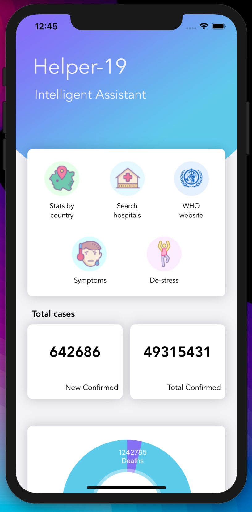
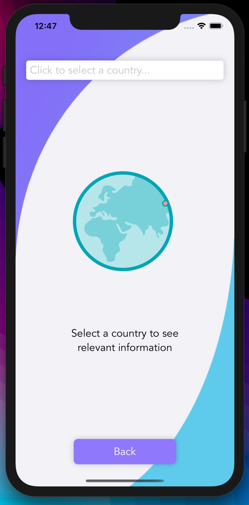
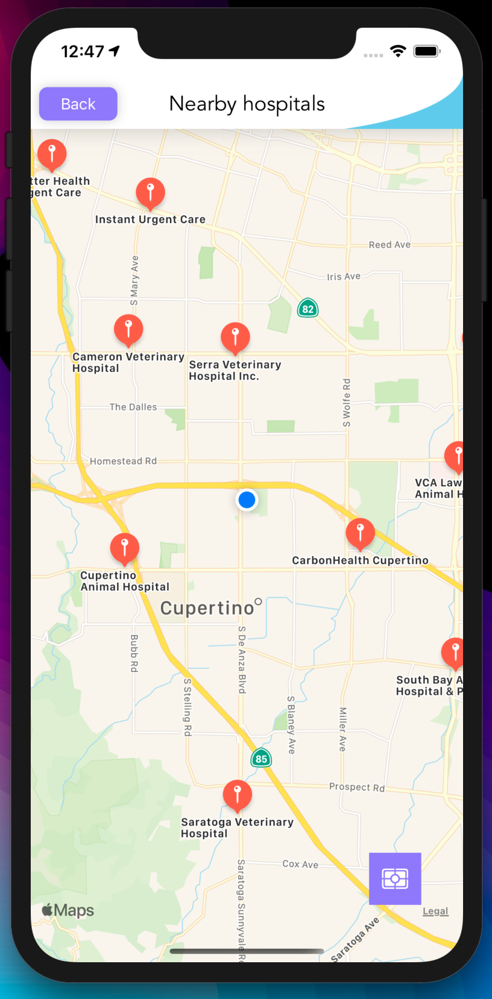
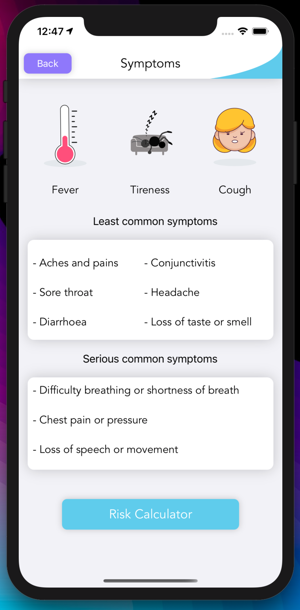
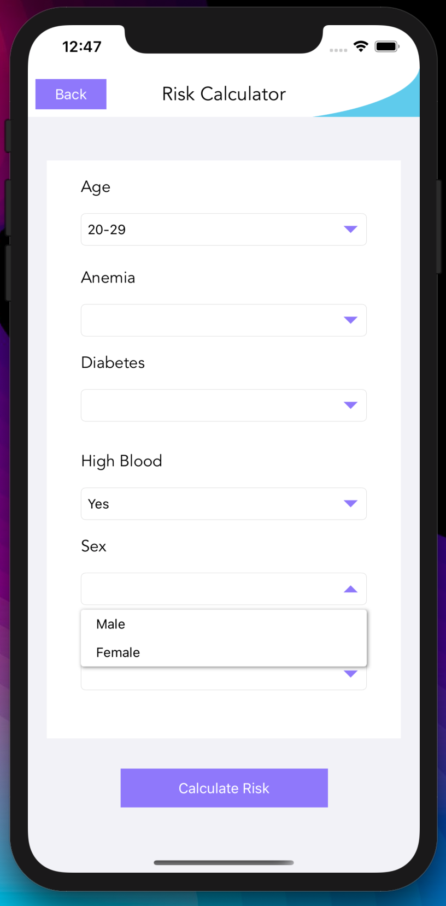
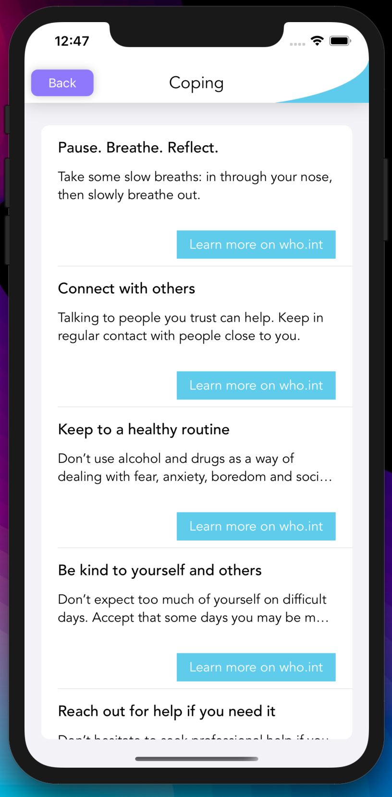

[![Contributors][contributors-shield]][contributors-url]
[![Forks][forks-shield]][forks-url]
[![Stargazers][stars-shield]][stars-url]
[![Issues][issues-shield]][issues-url]
[![MIT License][license-shield]][license-url]
[![LinkedIn][linkedin-shield]][linkedin-url]


<!-- PROJECT LOGO -->
<br />
<p align="center">
  <a href="https://github.com/IvanPedrero/Covid-19_Intelligent-Assistant">
    
  </a>

  <h3 align="center">Covid-19 Intelligent Assitant</h3>

  <p align="center">
    Winner project of the hackathon "Hack N' Jam 2020", by Tecnológico de Monterrey, campus Toluca.
    <br />
    An intelligent assitant that implements various types and frameworks of artificial intelligence to provide a tool that helps the user to avoid becoming infected.
    <br />
    <a href="https://github.com/IvanPedrero/Covid-19_Intelligent-Assistant">View Demo</a>
  </p>
</p>


<!-- TABLE OF CONTENTS -->
<details open="open">
  <summary>Table of Contents</summary>
  <ol>
    <li>
      <a href="#about-the-project">About The Project</a>
      <ul>
        <li><a href="#built-with">Built With</a></li>
      </ul>
    </li>
    <li>
      <a href="#getting-started">Getting Started</a>
      <ul>
        <li><a href="#prerequisites">Prerequisites</a></li>
        <li><a href="#installation">Installation</a></li>
      </ul>
    </li>
    <li><a href="#license">License</a></li>
    <li><a href="#contact">Contact</a></li>
  </ol>
</details>


<!-- ABOUT THE PROJECT -->
## About The Project

<br/>
<div>
  
  
</div>
<br/>

An intelligent assitant that implements various types and frameworks of artificial intelligence to provide a tool 
that helps the user to avoid becoming infected.

It implements the following tools:

* Risk Prediction: CoreML Model that provides a prediction of risk of the user given some variables in the form of a questionnaire (Using a linear regression model).

* COVID Intelligent Assistant: Watson Assistant that provides insight, answers and tips about the current pandemic of COVID. 

* Hospitals near device's location: MapKit that queries the hospitals near the user and list them in an interactive map. If clicked on a hospital in the map, the app will open Apple Maps with the driving directions of the selected hospital.

* Tips: Tips to de-stress during the pandemic (provided by the WHO).

* Links: To official sources of information (like WHO).

The information fetched by the app is from [https://covid19api.com/](https://covid19api.com/), a free API  which sources the data from Johns Hopkins CSSE (Built by Kyle Redelinghuys).

The models were trained with a simplified version of the dataset [https://www.kaggle.com/allen-institute-for-ai/CORD-19-research-challenge](https://www.kaggle.com/allen-institute-for-ai/CORD-19-research-challenge), fetched in Kaggle.

<br/>
<div>
  
  
</div>
<br/>


### Built With

* [Xcode](https://developer.apple.com/xcode/)
* [https://covid19api.com/](https://covid19api.com/)


<!-- GETTING STARTED -->
## Getting Started

What you'll need to run the app:

### Prerequisites

* MacOS (Catalina or higher)
* Xcode (11.0 or higher)
* CocoaPods [https://cocoapods.org/](https://cocoapods.org/)
* iPhone or iPod (if you want to run the app in a physical device)

### Installation

1. Run the following command in the root directory to install the necessary CocoaPods dependencies:
```
pod install
```
2. Open the project .workspace file (NOT the .xcodeproj)
3. Run the app in the simulator or device.

<br/>
<div>
  
  
</div>
<br/>

<!-- LICENSE -->
## License

Distributed under the MIT License. See `LICENSE` for more information.


<!-- CONTACT -->
## Contact

Your Name - [LinkedIn](https://www.linkedin.com/in/ivan-pedrero/) - pedrero.ivan@hotmail.com

Project Link: [https://github.com/IvanPedrero/Covid-19_Intelligent-Assistant](https://github.com/IvanPedrero/Covid-19_Intelligent-Assistant)


<!-- MARKDOWN LINKS & IMAGES -->
<!-- https://www.markdownguide.org/basic-syntax/#reference-style-links -->
[contributors-shield]: https://img.shields.io/github/contributors/othneildrew/Best-README-Template.svg?style=for-the-badge
[contributors-url]: https://github.com/IvanPedrero/Covid-19_Intelligent-Assistant/graphs/contributors
[forks-shield]: https://img.shields.io/github/forks/othneildrew/Best-README-Template.svg?style=for-the-badge
[forks-url]: https://github.com/IvanPedrero/Covid-19_Intelligent-Assistant/network/members
[stars-shield]: https://img.shields.io/github/stars/othneildrew/Best-README-Template.svg?style=for-the-badge
[stars-url]: https://github.com/IvanPedrero/Covid-19_Intelligent-Assistant/stargazers
[issues-shield]: https://img.shields.io/github/issues/othneildrew/Best-README-Template.svg?style=for-the-badge
[issues-url]: https://github.com/IvanPedrero/Covid-19_Intelligent-Assistant/issues
[license-shield]: https://img.shields.io/github/license/othneildrew/Best-README-Template.svg?style=for-the-badge
[license-url]: https://github.com/IvanPedrero/Covid-19_Intelligent-Assistantblob/master/LICENSE.txt
[linkedin-shield]: https://img.shields.io/badge/-LinkedIn-black.svg?style=for-the-badge&logo=linkedin&colorB=555
[linkedin-url]: https://www.linkedin.com/in/ivan-pedrero/
[product-screenshot-1]: images/ss1.png 
[product-screenshot-2]: images/ss2.png
[product-screenshot-3]: images/ss3.png
[product-screenshot-4]: images/ss4.png
[product-screenshot-5]: images/ss5.png
[product-screenshot-6]: images/ss6.png
